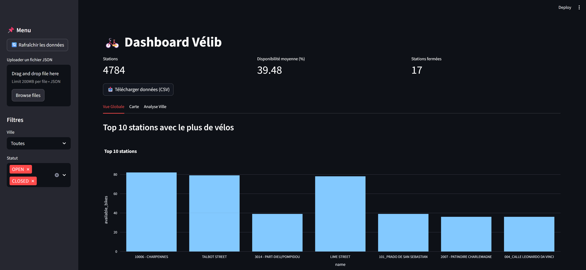
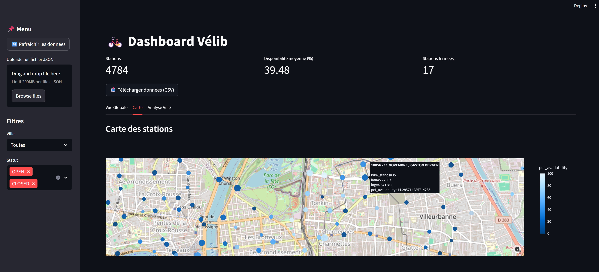
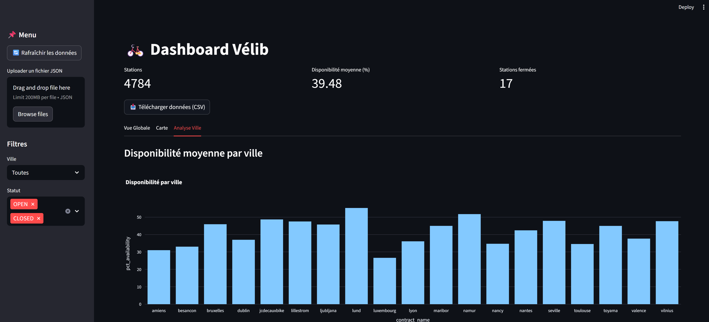
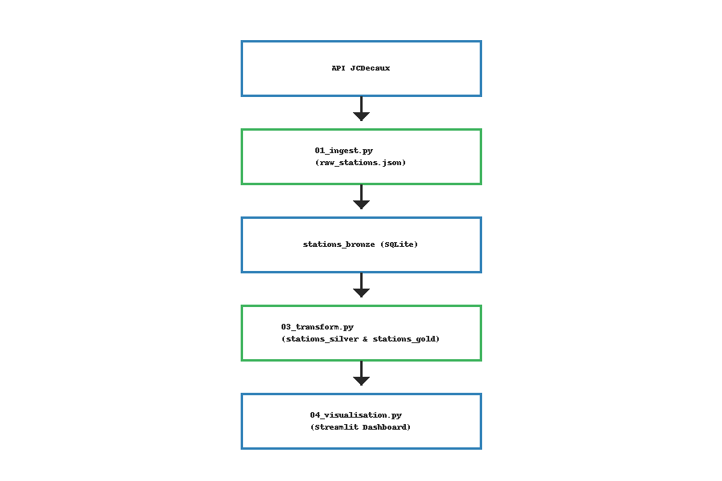

# 🚲 Dashboard Vélib avec Streamlit et SQLite

## 📌 Description
Ce projet consiste à créer un pipeline **de bout en bout** pour analyser les stations Vélib à partir des données de l’API JCDecaux.  
Il inclut :
- Ingestion des données depuis l'API
- Stockage dans SQLite (Bronze → Silver → Gold)
- Visualisation interactive avec **Streamlit**

---

## ✅ Fonctionnalités
- Rafraîchissement des données en un clic
- Upload de fichier JSON externe
- Téléchargement des données filtrées en CSV
- Carte interactive avec disponibilité des stations
- KPIs dynamiques et graphiques interactifs

---

## 📂 Structure du projet
velib_data_project/
├── 01_ingest.py # Ingestion depuis l'API
├── 02_load_sqlite.py # Stockage dans SQLite
├── 03_transform.py # Nettoyage et enrichissement
├── 04_visualisation.py # Dashboard Streamlit
├── data/
│ └── raw_stations.json
├── velib_data.db # Base SQLite
├── requirements.txt
└── README.md

---

## ⚙️ Installation
1. Clonez le projet :
   ```bash
   git clone https://github.com/<TON_USER>/velib_data_project.git
   cd velib_data_project

2. Créez un environnement virtuel et installez les dépendances :
    pip install -r requirements.txt


---

## ▶️ Execution
1. Lancer le pipeline complet :
    python 01_ingest.py
    python 02_load_sqlite.py
    python 03_transform.py

2. Lancer le dashboard Streamlit :
    streamlit run 04_visualisation.py

---

## ▶️ Aperçu




## ✅ Tech Stack
- Python (requests, pandas, Streamlit, Plotly)
- SQLite
- API JCDecaux Vélib

## 🔗 Auteur
Projet réalisé par Axel Maurel Angu à l'aide de ChatGPT

## ✅ Diagramme Pipeline (style moderne)

